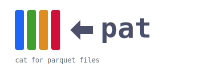
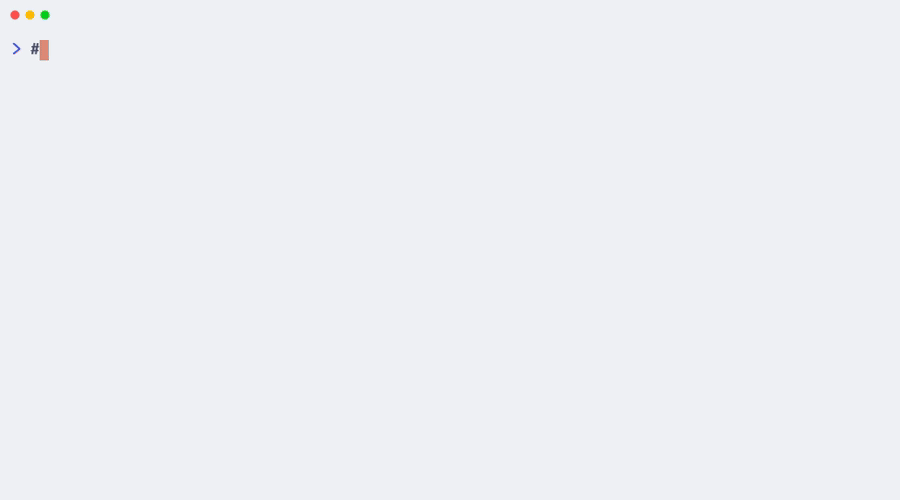

<p align="center">
  
</p>

---

## Demo

<p align="center">
  
</p>

## Installation

### Homebrew

```sh
brew tap ebommes/tap
brew install pat
```

### Cargo

```sh
cargo install --git https://github.com/ebommes/pat
```

### Binary download

Pre-built binaries for macOS and Linux (x86_64 and arm64) are available on the [releases page](https://github.com/ebommes/pat/releases).

## Usage

```
pat [OPTIONS] <FILES>...
```

By default, `pat` outputs CSV to stdout.

```sh
pat data.parquet
```

### Output formats

```sh
# CSV (default)
pat data.parquet

# Pretty ASCII table
pat --pretty data.parquet

# NDJSON (one JSON object per line, works with jq)
pat --json data.parquet | jq .
```

### Limit rows

```sh
# Show only the first 20 rows
pat -n 20 data.parquet
```

### Options

| Flag | Short | Description |
| ------ | ------- | ------------- |
| `--pretty` | `-p` | Output as a formatted ASCII table |
| `--json` | `-j` | Output as NDJSON (jq-compatible) |
| `--lines N` | `-n N` | Limit output to first N rows |

### Cloud storage

`pat` can read directly from S3, GCS, and Azure Blob Storage.

```sh
pat s3://my-bucket/data.parquet
pat gs://my-bucket/data.parquet
pat az://my-container/data.parquet
```

Authentication uses standard environment variables and instance roles:

| Provider | Environment variables |
| -------- | --------------------- |
| AWS S3 | `AWS_ACCESS_KEY_ID`, `AWS_SECRET_ACCESS_KEY`, `AWS_DEFAULT_REGION` |
| Google Cloud Storage | `GOOGLE_SERVICE_ACCOUNT` or `GOOGLE_APPLICATION_CREDENTIALS` (Workload Identity also supported) |
| Azure Blob Storage | `AZURE_STORAGE_ACCOUNT_NAME`, `AZURE_STORAGE_ACCESS_KEY` |

### Multiple files

```sh
pat file1.parquet file2.parquet
```

## Supported compression

pat supports Parquet files compressed with Snappy, Zstd, and LZ4.

## License

MIT
